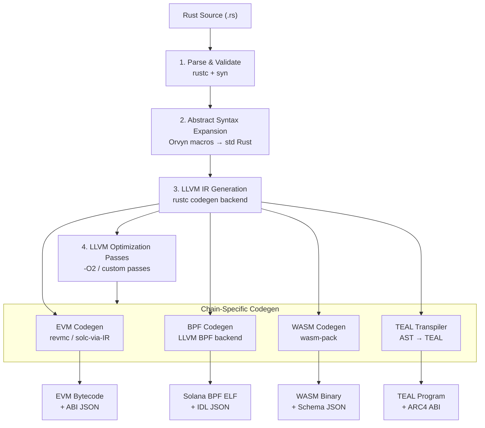
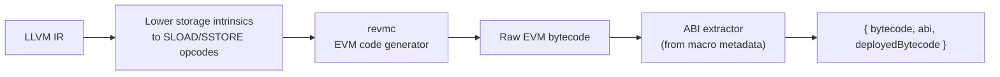
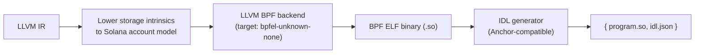
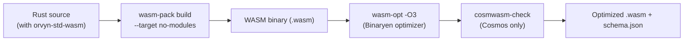
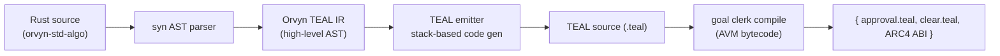
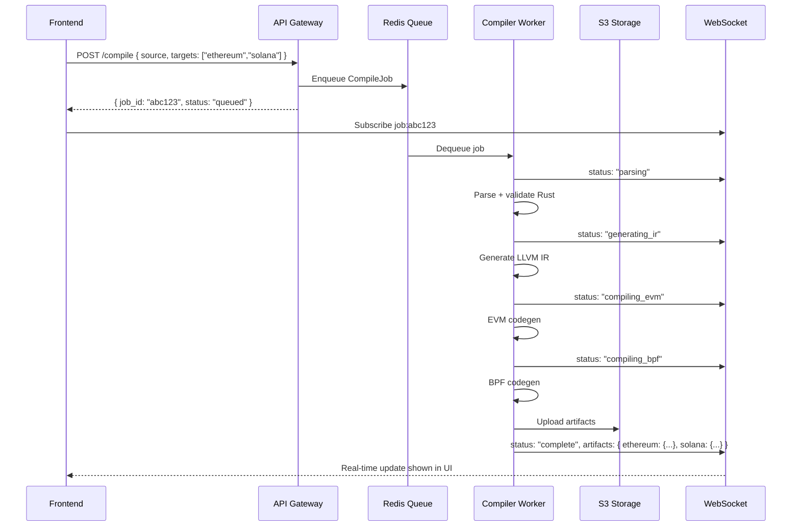

# Orvyn — Multi-VM Compilation Pipeline
> How Rust source compiles to chain-specific bytecode across all target VMs.

---

## Pipeline Overview



---

## Stage 1: Parse & Validate

The Rust source is validated using `rustc`'s library mode. Orvyn wraps the compiler API to extract:
- Syntax errors with line/column
- Type errors
- Missing imports from `orvyn-std` (Orvyn's blockchain abstraction library)

```rust
// crates/orvyn-compiler/src/pipeline/parse.rs
use rustc_interface::Config;

pub struct ParseResult {
    pub diagnostics: Vec<Diagnostic>,
    pub ast: Option<rustc_ast::Crate>,
    pub success: bool,
}

pub fn parse_and_validate(source: &str) -> ParseResult {
    let config = compiler_config(source);
    rustc_interface::run_compiler(config, |compiler| {
        compiler.enter(|queries| {
            queries.global_ctxt().unwrap().enter(|tcx| {
                let diagnostics = collect_diagnostics(tcx);
                ParseResult {
                    diagnostics,
                    ast: None, // extracted separately
                    success: diagnostics.iter().all(|d| d.level != Level::Error),
                }
            })
        })
    })
}
```

---

## Stage 2: Orvyn Macro Expansion

Developers use Orvyn's abstraction macros. These expand to standard Rust before compilation:

```rust
// Developer writes:
#[orvyn::contract]
pub struct MyToken {
    #[orvyn::storage]
    balances: Mapping<Address, u128>,
    total_supply: u128,
}

#[orvyn::contract_impl]
impl MyToken {
    #[orvyn::constructor]
    pub fn new(supply: u128) -> Self { ... }

    #[orvyn::callable]
    pub fn transfer(&mut self, to: Address, amount: u128) -> Result<()> { ... }
}

// Orvyn proc-macro expands to chain-agnostic Rust
// with storage hooks, ABI metadata, entry points
```

**Macro expansion produces:**
- Storage read/write abstraction calls
- Entry point functions (chain-agnostic `call()`, `deploy()`)
- ABI metadata embedded as `#[doc]` attributes
- Gas metering instrumentation points

---

## Stage 3: LLVM IR Generation

Rust compiles to LLVM IR using `rustc`'s standard codegen backend, with Orvyn-specific passes registered:

```
; Example LLVM IR fragment (transfer function)
define i32 @orvyn_transfer(%MyToken* %self, i256 %to, i128 %amount) {
entry:
  %balance = call i128 @orvyn_storage_read(i256 %to)
  %new_balance = add i128 %balance, %amount
  call void @orvyn_storage_write(i256 %to, i128 %new_balance)
  ret i32 0
}
```

The IR uses Orvyn's **storage intrinsics** (`orvyn_storage_read`, `orvyn_storage_write`) which are later lowered to chain-specific storage opcodes in each codegen backend.

---

## Stage 4: LLVM Optimization

Standard LLVM optimization pipeline with blockchain-specific passes:

```rust
// crates/orvyn-compiler/src/pipeline/optimize.rs
pub fn apply_optimization_passes(module: &mut LLVMModule, level: OptLevel) {
    let pass_manager = LLVMPassManagerBuilder::new();

    match level {
        OptLevel::O0 => {} // no optimization (debug)
        OptLevel::O1 => pass_manager.set_opt_level(1),
        OptLevel::O2 => {
            pass_manager.set_opt_level(2);
            pass_manager.add_inliner_with_threshold(200);
        }
        OptLevel::Os => {
            // Size optimization — important for on-chain storage costs
            pass_manager.set_size_level(1);
            pass_manager.add_dead_code_elimination_pass();
            pass_manager.add_constant_propagation_pass();
        }
    }

    // Orvyn custom passes
    pass_manager.add_pass(StorageAccessCoalescing::new()); // merge reads
    pass_manager.add_pass(GasMeteringInsertion::new());    // insert gas checkpoints
    pass_manager.run(module);
}
```

---

## Stage 5A: EVM Bytecode (Ethereum, Polygon, BSC)

**Path:** LLVM IR → EVM bytecode via `revmc` (LLVM-based EVM compiler)



**Storage intrinsic lowering:**
```
; LLVM IR:
%val = call i256 @orvyn_storage_read(i256 %slot)

; Lowered to EVM opcodes:
PUSH32 <slot>
SLOAD
```

**Output format:**
```json
{
  "chain": "ethereum",
  "bytecode": "0x608060405234801561001057600080fd...",
  "deployedBytecode": "0x6080604052...",
  "abi": [
    {
      "name": "transfer",
      "type": "function",
      "inputs": [
        { "name": "to", "type": "address" },
        { "name": "amount", "type": "uint256" }
      ],
      "outputs": [{ "name": "", "type": "bool" }],
      "stateMutability": "nonpayable"
    }
  ],
  "gasEstimate": 45230
}
```

---

## Stage 5B: Solana BPF (Solana)

**Path:** LLVM IR → BPF ELF binary via LLVM's BPF backend



**Key difference — account model translation:**
Solana has no built-in storage slots. Orvyn maps contract storage to **Program Derived Addresses (PDAs)**:

```rust
// orvyn-std maps storage fields to PDAs:
// Mapping<Address, u128> → seeds: ["balance", address_bytes]
// This is transparent to the developer
#[orvyn::storage]
balances: Mapping<Address, u128>
// expands to PDA-based read/write in Solana target
```

**BPF compilation command (internal):**
```bash
cargo build-bpf \
  --manifest-path Cargo.toml \
  --bpf-sdk /usr/local/solana/sdk/bpf \
  -- --target bpfel-unknown-none -C opt-level=2
```

---

## Stage 5C: WASM (Near Protocol, Polkadot/ink!)

**Path:** Rust → WASM via `wasm-pack` + `wasm-opt`



**Near vs Polkadot differences:**
| Aspect | Near | Polkadot (ink!) |
|--------|------|-----------------|
| Storage | Near SDK state | ink! storage traits |
| Entry points | `#[near_bindgen]` | `#[ink::contract]` |
| WASM host imports | `near_sdk::env` | `ink_env` |
| ABI format | `ABI.json` (near) | `metadata.json` (ink!) |

Orvyn generates a **target-specific adapter shim** that bridges the generic WASM binary to each chain's WASM host ABI.

---

## Stage 5D: TEAL (Algorand)

**Path:** Rust AST → TEAL via Orvyn's transpiler (not LLVM-based)

TEAL is a stack-based assembly language. Orvyn uses a **dedicated AST transpiler** rather than LLVM because TEAL's execution model diverges from register-based IR.



**Rust → TEAL example:**
```rust
// Developer writes:
pub fn transfer(&mut self, to: Address, amount: u64) {
    let balance = self.balances.get(sender());
    assert!(balance >= amount, "insufficient funds");
    self.balances.set(sender(), balance - amount);
    self.balances.set(to, self.balances.get(to) + amount);
}

// Orvyn TEAL emitter outputs:
// txn Sender
// app_global_get         ; get sender balance
// store 0
// load 0
// int <amount>
// >=
// assert                 ; insufficient funds check
// ...
```

---

## Compilation Job Lifecycle



---

## Compilation Sandbox Security

All user-submitted Rust code executes in an **isolated gVisor sandbox**:

```yaml
# k8s/compiler-sandbox.yaml
apiVersion: v1
kind: Pod
spec:
  runtimeClassName: gvisor      # gVisor kernel intercept
  containers:
  - name: compiler-sandbox
    image: orvyn/compiler-sandbox:latest
    resources:
      limits:
        cpu: "2"
        memory: "2Gi"
      requests:
        cpu: "500m"
        memory: "512Mi"
    securityContext:
      runAsNonRoot: true
      readOnlyRootFilesystem: true
      allowPrivilegeEscalation: false
    env:
    - name: COMPILE_TIMEOUT_SECS
      value: "60"
```

**Security measures:**
- No network access inside sandbox
- Read-only filesystem (tmp only for build output)
- CPU + memory limits enforced
- 60-second hard timeout
- Job killed if memory exceeds 2GB

---

## Compilation Error Format

Errors returned to the frontend include precise source location:

```json
{
  "status": "failed",
  "errors": [
    {
      "level": "error",
      "code": "E0308",
      "message": "mismatched types: expected `u128`, found `u64`",
      "location": {
        "file": "main.rs",
        "line": 24,
        "column": 18,
        "end_line": 24,
        "end_column": 25
      },
      "suggestion": "try using `amount as u128`",
      "chain": null
    },
    {
      "level": "warning",
      "code": "W001",
      "message": "Storage slot `balances` accessed 3 times in one call — consider caching",
      "chain": "ethereum",
      "gas_impact": "+4200 gas"
    }
  ]
}
```

---

## Gas Optimization Per Chain

After codegen, Orvyn applies chain-specific gas optimizations:

| Chain | Optimization | Savings |
|-------|-------------|---------|
| Ethereum | Pack storage slots (< 32 bytes) | 15,000 gas/write |
| Ethereum | Use `calldata` instead of `memory` for read-only params | 3–5% |
| Solana | Minimize account data size | Reduces rent |
| Cosmos | Inline small functions (reduce message dispatch) | 10% |
| Algorand | Box storage vs global storage routing | Varies |
| All EVM | Replace `SSTORE` 0-value with `SDELETE` | 15,000 gas refund |

```rust
// crates/orvyn-compiler/src/pipeline/optimize.rs
pub fn apply_chain_optimizations(
    bytecode: &mut Bytecode,
    chain: Chain,
) {
    match chain {
        Chain::Ethereum | Chain::Polygon | Chain::BinanceSmartChain => {
            pack_storage_slots(bytecode);
            optimize_calldata_params(bytecode);
            insert_sdelete_for_zero_writes(bytecode);
        }
        Chain::Solana => {
            minimize_account_data(bytecode);
        }
        _ => {}
    }
}
```