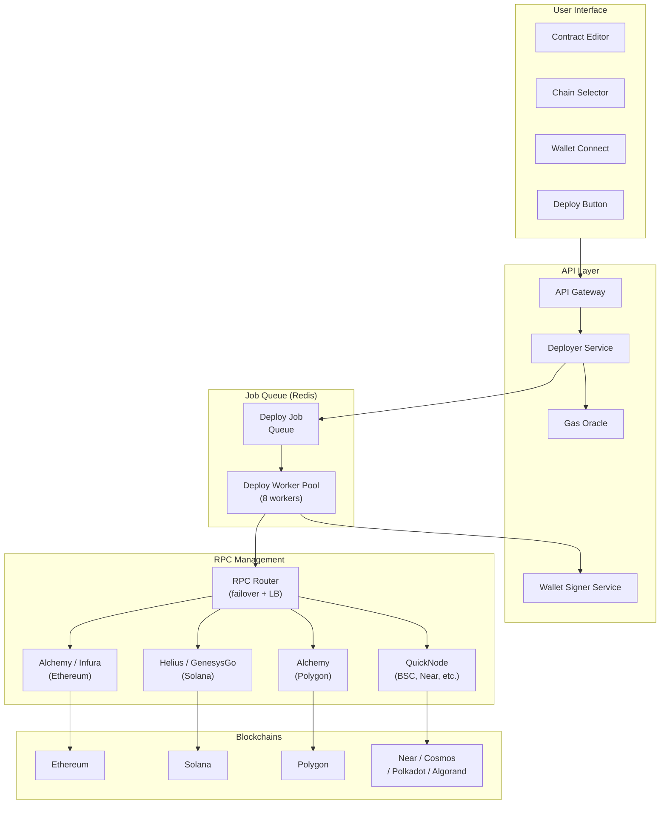
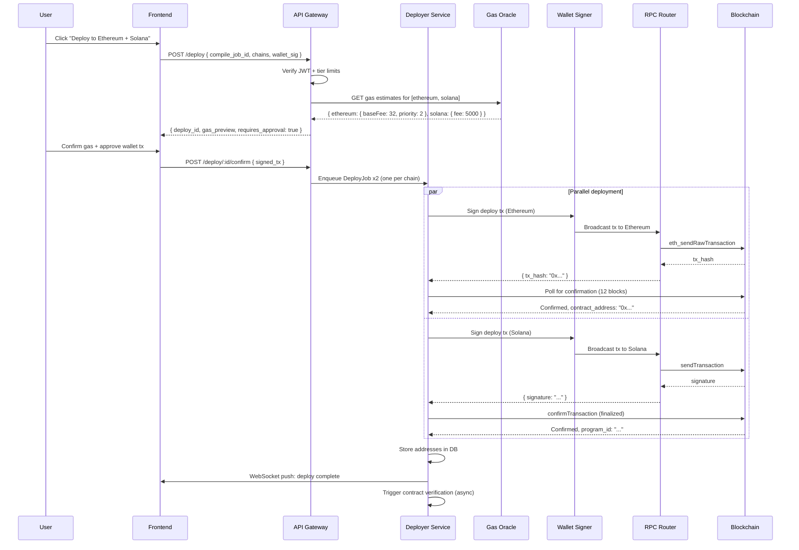

# Orvyn — Deployment Architecture
> How one-click deploy works across 10+ blockchains with different RPCs, auth, and wallets.

---

## Deployment System Overview



---

## One-Click Deploy Flow

### Step-by-step sequence



---

## Wallet Integration Architecture

Orvyn supports three wallet types via a unified **WalletAdapter** trait:

```rust
// crates/orvyn-wallet/src/lib.rs
#[async_trait]
pub trait WalletAdapter: Send + Sync {
    async fn sign_transaction(&self, tx: &UnsignedTx) -> Result<SignedTx>;
    async fn get_address(&self) -> Result<String>;
    async fn get_balance(&self) -> Result<u64>;
    fn chain_type(&self) -> ChainType; // EVM | SVM | Cosmos
}

pub enum WalletSource {
    // User-provided private key (enterprise/CI use)
    PrivateKey(EncryptedKeystore),
    // User signs in browser via wallet extension
    BrowserWallet { session_id: Uuid },
    // Hardware wallet (Ledger)
    HardwareWallet { device_id: String },
}
```

### Browser Wallet Flow (MetaMask / Phantom / Keplr)

```typescript
// Frontend: apps/web/src/hooks/useWallet.ts
export function useWallet() {
  const connectEVM = async () => {
    // MetaMask / injected EVM wallet
    const provider = new ethers.BrowserProvider(window.ethereum);
    const signer = await provider.getSigner();
    return { address: await signer.getAddress(), type: 'evm' };
  };

  const connectSolana = async () => {
    // Phantom wallet
    const { solana } = window;
    await solana.connect();
    return { address: solana.publicKey.toString(), type: 'solana' };
  };

  const connectCosmos = async () => {
    // Keplr wallet
    await window.keplr.enable('cosmoshub-4');
    const key = await window.keplr.getKey('cosmoshub-4');
    return { address: key.bech32Address, type: 'cosmos' };
  };
}
```

### Server-Side Signing (CI/CD Mode)

For headless deployments via SDK, Orvyn stores **encrypted keystores** in HashiCorp Vault:

```rust
// services/deployer-service/src/wallet/keystore.rs
pub struct VaultKeystore {
    vault_client: VaultClient,
    key_path: String, // vault/secret/orvyn/keys/<user_id>/<chain>
}

impl VaultKeystore {
    pub async fn load_signer(&self, chain: Chain) -> Result<Box<dyn Signer>> {
        let secret = self.vault_client
            .get_secret(&format!("{}/{}", self.key_path, chain.id()))
            .await?;

        match chain.chain_type() {
            ChainType::Evm => {
                let wallet = LocalWallet::from_bytes(&hex::decode(secret.data)?)?;
                Ok(Box::new(wallet))
            }
            ChainType::Solana => {
                let keypair = Keypair::from_bytes(&bs58::decode(secret.data).into_vec()?)?;
                Ok(Box::new(SolanaWalletAdapter::new(keypair)))
            }
            _ => Err(OrvynError::UnsupportedChain(chain)),
        }
    }
}
```

---

## RPC Management

### Multi-RPC Router

Each chain has 2–3 RPC providers configured for failover:

```rust
// services/deployer-service/src/rpc/router.rs
pub struct RpcRouter {
    providers: HashMap<Chain, Vec<RpcProvider>>,
    health: Arc<RwLock<HashMap<String, ProviderHealth>>>,
}

impl RpcRouter {
    pub async fn get_provider(&self, chain: Chain) -> Result<&RpcProvider> {
        let providers = self.providers.get(&chain)
            .ok_or(OrvynError::UnsupportedChain(chain))?;

        // Round-robin with health check
        for provider in providers {
            let health = self.health.read().await;
            if health.get(&provider.id).map(|h| h.is_healthy()).unwrap_or(true) {
                return Ok(provider);
            }
        }
        Err(OrvynError::AllRpcsFailed(chain))
    }
}
```

### RPC Provider Config

```toml
# config/rpc.toml
[chains.ethereum]
providers = [
    { id = "alchemy-eth", url = "${ALCHEMY_ETH_URL}", priority = 1 },
    { id = "infura-eth",  url = "${INFURA_ETH_URL}",  priority = 2 },
    { id = "cloudflare",  url = "https://cloudflare-eth.com", priority = 3 },
]
confirmation_blocks = 12
timeout_secs = 30

[chains.solana]
providers = [
    { id = "helius",     url = "${HELIUS_RPC_URL}",   priority = 1 },
    { id = "genesysgo", url = "${GENESYSGO_RPC_URL}", priority = 2 },
    { id = "mainnet",   url = "https://api.mainnet-beta.solana.com", priority = 3 },
]
confirmation_type = "finalized"
timeout_secs = 60

[chains.polygon]
providers = [
    { id = "alchemy-poly", url = "${ALCHEMY_POLY_URL}", priority = 1 },
    { id = "quicknode-poly", url = "${QN_POLY_URL}",    priority = 2 },
]
confirmation_blocks = 128
timeout_secs = 30
```

---

## Chain-Specific Deployment Details

### Ethereum / Polygon / BSC (EVM)
```rust
// crates/orvyn-chains/src/evm.rs
pub async fn deploy_evm(
    bytecode: &[u8],
    abi: &Abi,
    constructor_args: &[Token],
    signer: &dyn Signer,
    provider: &Provider<Http>,
    gas_strategy: GasStrategy,
) -> Result<DeploymentResult> {
    let factory = ContractFactory::new(abi.clone(), bytecode.into(), provider.clone());

    let gas_price = match gas_strategy {
        GasStrategy::Standard => provider.get_gas_price().await?,
        GasStrategy::Fast => provider.get_gas_price().await? * 120 / 100, // +20%
        GasStrategy::Optimized => calculate_optimal_gas(provider).await?,
    };

    let deployer = factory.deploy(constructor_args.to_vec())?
        .gas_price(gas_price)
        .confirmations(12);

    let (contract, receipt) = deployer.send_with_receipt().await?;

    Ok(DeploymentResult {
        address: format!("{:?}", contract.address()),
        tx_hash: format!("{:?}", receipt.transaction_hash),
        gas_used: receipt.gas_used.unwrap_or_default().as_u64(),
        block_number: receipt.block_number.unwrap_or_default().as_u64(),
    })
}
```

### Solana
```rust
// crates/orvyn-chains/src/solana.rs
pub async fn deploy_solana(
    program_data: &[u8],
    keypair: &Keypair,
    rpc_client: &RpcClient,
) -> Result<DeploymentResult> {
    let program_keypair = Keypair::new();
    let program_id = program_keypair.pubkey();

    // Allocate program account
    let lamports = rpc_client
        .get_minimum_balance_for_rent_exemption(program_data.len())?;

    // Deploy via BPF loader
    let instructions = bpf_loader_upgradeable::deploy_with_max_program_len(
        &keypair.pubkey(),
        &program_id,
        &keypair.pubkey(),
        program_data,
        program_data.len() * 2, // max upgrade buffer
    )?;

    let tx = Transaction::new_signed_with_payer(
        &instructions,
        Some(&keypair.pubkey()),
        &[keypair, &program_keypair],
        rpc_client.get_latest_blockhash()?,
    );

    let signature = rpc_client.send_and_confirm_transaction_with_spinner(&tx)?;

    Ok(DeploymentResult {
        address: program_id.to_string(),
        tx_hash: signature.to_string(),
        gas_used: 0, // Solana charges in SOL lamports, tracked separately
        block_number: 0,
    })
}
```

---

## Contract Verification (Post-Deploy)

After deployment, Orvyn automatically verifies contracts on block explorers:

```rust
// services/verifier-service/src/lib.rs
pub async fn verify_contract(deployment: &Deployment, source: &str) -> Result<()> {
    match deployment.chain {
        Chain::Ethereum => {
            etherscan_verify(
                &deployment.contract_address,
                source,
                &deployment.compiler_version,
            ).await?;
        }
        Chain::Polygon => {
            polygonscan_verify(&deployment.contract_address, source).await?;
        }
        Chain::Solana => {
            // Solana: Upload source to verified.build
            verified_build_submit(&deployment.contract_address, source).await?;
        }
        Chain::Cosmos => {
            // CosmWasm: Submit source to code_id registry
            cosmscan_verify(&deployment.contract_address, source).await?;
        }
        _ => {
            tracing::warn!("Verification not yet supported for {:?}", deployment.chain);
        }
    }
    Ok(())
}
```

---

## REST API Endpoints

### Deployment API
```
POST   /api/v1/deploy
GET    /api/v1/deploy/:deploy_id
POST   /api/v1/deploy/:deploy_id/confirm
DELETE /api/v1/deploy/:deploy_id          (cancel pending)
GET    /api/v1/deploy/:deploy_id/logs
GET    /api/v1/projects/:id/deployments
```

### Gas API
```
GET    /api/v1/gas/:chain                 (current gas prices)
POST   /api/v1/gas/estimate              (estimate for specific contract)
```

### Request: `POST /api/v1/deploy`
```json
{
  "compile_job_id": "uuid",
  "chains": ["ethereum", "polygon"],
  "networks": {
    "ethereum": "mainnet",
    "polygon": "mainnet"
  },
  "gas_strategy": "optimized",
  "wallet_source": "browser",
  "constructor_args": ["1000000", "MyToken", "MTK"]
}
```

### Response: `GET /api/v1/deploy/:id`
```json
{
  "id": "deploy_abc123",
  "status": "complete",
  "created_at": "2025-06-01T12:00:00Z",
  "completed_at": "2025-06-01T12:01:23Z",
  "results": {
    "ethereum": {
      "status": "success",
      "contract_address": "0xAbCd...1234",
      "tx_hash": "0xDead...Beef",
      "gas_used": 412500,
      "gas_price_gwei": 34.5,
      "cost_eth": "0.014231",
      "block_number": 19234567,
      "verified": true,
      "explorer_url": "https://etherscan.io/address/0xAbCd...1234"
    },
    "polygon": {
      "status": "success",
      "contract_address": "0xEfGh...5678",
      "tx_hash": "0xFeed...Face",
      "gas_used": 410200,
      "gas_price_gwei": 120.0,
      "cost_matic": "0.049224",
      "block_number": 54321098,
      "verified": true,
      "explorer_url": "https://polygonscan.com/address/0xEfGh...5678"
    }
  }
}
```

---

## Deployment Worker Kubernetes Config

```yaml
# k8s/deployer-worker.yaml
apiVersion: apps/v1
kind: Deployment
metadata:
  name: deployer-worker
  namespace: orvyn-production
spec:
  replicas: 4
  selector:
    matchLabels:
      app: deployer-worker
  template:
    metadata:
      labels:
        app: deployer-worker
    spec:
      serviceAccountName: deployer-worker-sa
      containers:
      - name: deployer-worker
        image: orvyn/deployer-service:latest
        resources:
          requests:
            cpu: "500m"
            memory: "512Mi"
          limits:
            cpu: "2"
            memory: "2Gi"
        env:
        - name: REDIS_URL
          valueFrom:
            secretKeyRef:
              name: orvyn-secrets
              key: redis-url
        - name: VAULT_ADDR
          value: "http://vault.orvyn-internal:8200"
        - name: WORKER_CONCURRENCY
          value: "4"
        livenessProbe:
          httpGet:
            path: /health
            port: 8080
          initialDelaySeconds: 30
          periodSeconds: 10
```

---

## Deployment Monitoring & Alerting

```yaml
# Prometheus alerts
groups:
- name: orvyn-deployment
  rules:
  - alert: DeploymentFailureRateHigh
    expr: rate(orvyn_deploy_failures_total[5m]) > 0.1
    severity: critical
    annotations:
      summary: "Deployment failure rate > 10%"

  - alert: RPCProviderDown
    expr: orvyn_rpc_health{status="unhealthy"} == 1
    severity: warning
    annotations:
      summary: "RPC provider {{ $labels.provider }} is unhealthy"

  - alert: DeployQueueBacklog
    expr: orvyn_deploy_queue_depth > 100
    severity: warning
    annotations:
      summary: "Deploy queue depth exceeds 100 jobs"
```