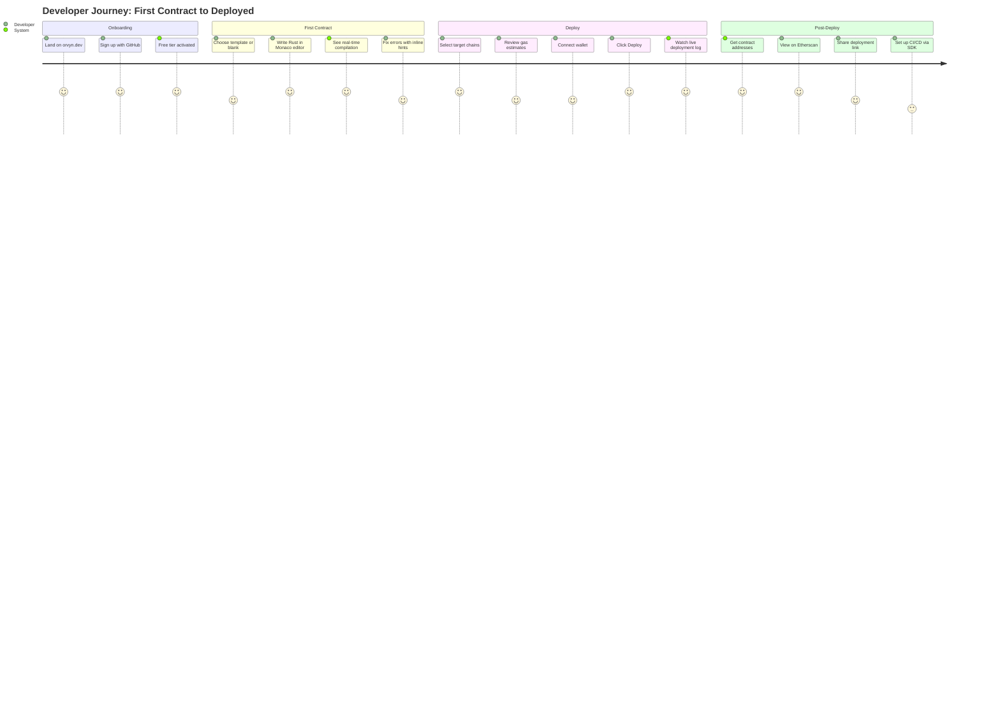

# Orvyn — Developer Experience Flow
> Complete UX from first login to deployed & verified contract.

---

## End-to-End Journey Overview



---

## Screen 1: Landing & Signup

### Flow
1. Developer lands on `orvyn.dev`
2. Sees headline: _"Write Rust once. Deploy to any blockchain."_
3. Live demo shows Rust contract → EVM bytecode in 6 seconds
4. CTA: **"Start for free"** (GitHub OAuth)

### GitHub OAuth Flow
```
GET /auth/github
  → redirect to github.com/login/oauth/authorize
  → callback: /auth/callback?code=xxx
  → exchange code for token
  → fetch GitHub user profile
  → upsert user in DB
  → issue JWT (7-day expiry)
  → redirect to /dashboard
```

### First Login: Setup Wizard
```
Step 1/3: Choose your experience level
  ◉ Smart contract beginner
  ○ Familiar with Solidity/Anchor
  ○ Experienced multi-chain developer

Step 2/3: What do you want to build?
  ☐ Token (ERC20 / SPL)
  ☐ NFT Collection
  ☐ DeFi Protocol
  ☐ DAO / Governance
  ☐ Custom contract

Step 3/3: Which chains matter to you?
  ☐ Ethereum   ☐ Solana   ☐ Polygon
  ☐ BSC        ☐ Near     ☐ Cosmos
```

---

## Screen 2: Project Dashboard

```
┌─────────────────────────────────────────────────────┐
│  Orvyn             Projects         + New Project    │
├──────────────┬──────────────────────────────────────┤
│              │  My Projects                         │
│  Dashboard   │                                      │
│  Projects  ◀ │  ┌────────────────┐ ┌─────────────┐ │
│  Templates   │  │ MyToken        │ │ + New        │ │
│  History     │  │ Ethereum·Sol   │ │  Project     │ │
│  Settings    │  │ Last: 2d ago   │ │             │ │
│              │  └────────────────┘ └─────────────┘ │
│  Free Tier   │                                      │
│  2/3 chains  │  Recent Deployments                  │
│  ████████░░  │  ┌──────────────────────────────┐   │
│              │  │ MyToken → Ethereum  ✓ Verified│   │
│  Upgrade →   │  │ 0x1234...abcd       2d ago    │   │
│              │  │ MyToken → Solana    ✓ Verified│   │
│              │  │ AaBb...XxYy         2d ago    │   │
│              │  └──────────────────────────────┘   │
└──────────────┴──────────────────────────────────────┘
```

---

## Screen 3: The Editor (Core Experience)

### Layout
```
┌──────────────────────────────────────────────────────────────┐
│  Orvyn  >  MyProject  >  MyToken.rs              [Deploy →]  │
├─────────────────────────────────┬────────────────────────────┤
│  FILE TREE                      │  MONACO EDITOR             │
│  ▼ MyProject                    │  1  #[orvyn::contract]     │
│    ▶ contracts/                 │  2  pub struct MyToken {   │
│      MyToken.rs ◀               │  3    #[orvyn::storage]    │
│    ▶ tests/                     │  4    balances: Mapping    │
│    README.md                    │      <Address, u128>,      │
│                                 │  5    total_supply: u128,  │
│  CHAIN TARGETS                  │  6  }                      │
│  ☑ Ethereum                     │  7                         │
│  ☑ Solana                       │  8  #[orvyn::contract_impl]│
│  ☐ Polygon                      │  9  impl MyToken {         │
│  ☐ BSC  [Upgrade]               │  10   #[orvyn::constructor]│
│  ☐ Near [Upgrade]               │  ...                       │
├─────────────────────────────────┴────────────────────────────┤
│  COMPILE OUTPUT                              ● Live  ⟳ 1.2s  │
│  ✓ Parsing...    ✓ IR Gen...    ⟳ EVM codegen...             │
│                                                               │
│  Errors: 0    Warnings: 1    Gas estimate: ~42,000 (ETH)     │
│  ⚠ Line 24: Consider caching `balances` read (+2100 gas)     │
└──────────────────────────────────────────────────────────────┘
```

### Monaco Editor Features
- **Rust syntax highlighting** with blockchain-aware tokens
- **Autocomplete** for `orvyn::` macros and `Address`, `Mapping` types
- **Inline error squiggles** synced from compiler output
- **Gas hint annotations** in gutter (estimated gas per line)
- **Cmd+S** triggers immediate recompile
- **Cmd+Shift+P** opens command palette: `Deploy to chain...`, `View bytecode...`

### Real-Time Compile WebSocket
```typescript
// apps/web/src/hooks/useCompile.ts
export function useCompile(contractId: string) {
  const [status, setStatus] = useState<CompileStatus>('idle');
  const [output, setOutput] = useState<CompileOutput | null>(null);

  useEffect(() => {
    const ws = new WebSocket(`wss://api.orvyn.dev/ws/compile/${contractId}`);

    ws.onmessage = (event) => {
      const msg = JSON.parse(event.data) as CompileEvent;

      switch (msg.type) {
        case 'stage': setStatus(msg.stage); break;
        case 'error': setOutput({ errors: msg.errors }); break;
        case 'complete': setOutput(msg.artifacts); setStatus('done'); break;
      }
    };

    return () => ws.close();
  }, [contractId]);

  return { status, output };
}
```

---

## Screen 4: Bytecode Preview

Before deploying, developers can inspect the compiled output per chain:

```
┌──────────────────────────────────────────────────────────────┐
│  Compile Results for MyToken.rs                              │
├─────────────────┬────────────────────────────────────────────┤
│  CHAIN          │  ETHEREUM                                  │
│  ● Ethereum  ◀  │                                            │
│  ● Solana       │  Bytecode (EVM)                            │
│                 │  ┌──────────────────────────────────────┐  │
│  SUMMARY        │  │ 0x608060405234801561001057600080fd5b  │  │
│  Size: 2.1 KB   │  │ 50610...                             │  │
│  Gas est: 42k   │  │                         [Copy] [Raw] │  │
│  Optimized: ✓   │  └──────────────────────────────────────┘  │
│                 │                                            │
│                 │  ABI                                       │
│                 │  ┌──────────────────────────────────────┐  │
│                 │  │ transfer(address to, uint256 amount) │  │
│                 │  │ balanceOf(address) → uint256         │  │
│                 │  │ totalSupply() → uint256              │  │
│                 │  └──────────────────────────────────────┘  │
│                 │                                            │
│                 │  Optimizations Applied                     │
│                 │  ✓ Storage slot packing                    │
│                 │  ✓ Dead code elimination                   │
│                 │  ✓ SDELETE for zero writes                 │
└─────────────────┴────────────────────────────────────────────┘
```

---

## Screen 5: Deploy Panel

```
┌──────────────────────────────────────────────────────────────┐
│  Deploy MyToken                                              │
├──────────────────────────────────────────────────────────────┤
│                                                              │
│  Target Chains                                               │
│  ┌─────────────────────────────────────────────────────┐    │
│  │  ☑ Ethereum Mainnet    Gas: ~42,000 • $4.20 est.    │    │
│  │  ☑ Solana Mainnet      Fee: 5,000 lamports • $0.01  │    │
│  │  ☐ Polygon (Upgrade to Pro)                         │    │
│  └─────────────────────────────────────────────────────┘    │
│                                                              │
│  Constructor Arguments                                       │
│  ┌─────────────────────────────────────────────────────┐    │
│  │  initial_supply  [1000000          ] uint128         │    │
│  │  name            [MyToken          ] string          │    │
│  │  symbol          [MTK              ] string          │    │
│  └─────────────────────────────────────────────────────┘    │
│                                                              │
│  Gas Strategy      ◉ Optimized  ○ Fast  ○ Standard          │
│  Environment       ◉ Mainnet    ○ Testnet                    │
│                                                              │
│  Connected Wallets                                           │
│  EVM:    MetaMask  0x1234...abcd  ✓                          │
│  Solana: Phantom   AaBb...XxYy   ✓                           │
│                                                              │
│  Total Estimated Cost: ~$4.21                               │
│                                                              │
│  [  Cancel  ]              [ Deploy to 2 chains → ]         │
└──────────────────────────────────────────────────────────────┘
```

---

## Screen 6: Live Deployment Progress

```
┌──────────────────────────────────────────────────────────────┐
│  Deploying MyToken...                                        │
├──────────────────────────────────────────────────────────────┤
│                                                              │
│  ETHEREUM                                          ⟳ Live   │
│  ──────────────────────────────────────────────────         │
│  ✓  Signing transaction...                                   │
│  ✓  Broadcasting to network...                              │
│  ✓  Transaction sent: 0xDead...Beef                         │
│  ⟳  Waiting for confirmations... (3 / 12)                   │
│     ████████░░░░░░░░░░░░░░░░░░░░░░░░░░░░░░  25%             │
│                                                              │
│  SOLANA                                            ✓ Done   │
│  ──────────────────────────────────────────────────         │
│  ✓  Signing transaction...                                   │
│  ✓  Broadcasting to network...                              │
│  ✓  Confirmed (finalized)                                   │
│  ✓  Program ID: AaBb...XxYy                                 │
│  ✓  Verified on Solscan                                     │
│                                                              │
│  Raw Logs  ▼                                                 │
│  [12:01:00] deployer: loading bytecode from S3              │
│  [12:01:01] deployer: signing with MetaMask session          │
│  [12:01:02] rpc: sent to alchemy-eth (primary)              │
└──────────────────────────────────────────────────────────────┘
```

---

## Screen 7: Deployment Success

```
┌──────────────────────────────────────────────────────────────┐
│  🎉 MyToken deployed successfully!                           │
├──────────────────────────────────────────────────────────────┤
│                                                              │
│  ETHEREUM MAINNET                              ✓ Verified    │
│  Contract: 0xAbCd...1234                                     │
│  [View on Etherscan ↗]  [Copy Address]                      │
│                                                              │
│  SOLANA MAINNET                                ✓ Verified    │
│  Program ID: AaBb...XxYy                                    │
│  [View on Solscan ↗]    [Copy Address]                      │
│                                                              │
│  ─────────────────────────────────────────────────────      │
│                                                              │
│  Share this deployment                                       │
│  https://app.orvyn.dev/deploy/abc123  [Copy] [Tweet]        │
│                                                              │
│  Next steps                                                  │
│  → Set up CI/CD with the TypeScript SDK                     │
│  → Interact with your contract in the console               │
│  → Deploy to Polygon (upgrade to Pro)                       │
│                                                              │
│  [ Back to Dashboard ]         [ Interact with Contract ]   │
└──────────────────────────────────────────────────────────────┘
```

---

## CI/CD Integration (TypeScript SDK)

After deploying manually once, developers can automate with the SDK:

### Installation
```bash
npm install @orvyn/sdk
```

### GitHub Actions Integration
```yaml
# .github/workflows/deploy.yml
name: Deploy Contracts
on:
  push:
    branches: [main]
    paths: ['contracts/**']

jobs:
  deploy:
    runs-on: ubuntu-latest
    steps:
      - uses: actions/checkout@v4

      - name: Deploy via Orvyn
        uses: orvyn/deploy-action@v1
        with:
          api-key: ${{ secrets.ORVYN_API_KEY }}
          contract-path: ./contracts/MyToken.rs
          chains: ethereum,polygon,solana
          environment: production
          gas-strategy: optimized
```

### SDK Usage
```typescript
import { Orvyn } from '@orvyn/sdk';

const client = new Orvyn({
  apiKey: process.env.ORVYN_API_KEY,
});

// Deploy to multiple chains
const deployment = await client.deploy({
  contractPath: './contracts/MyToken.rs',
  chains: ['ethereum', 'polygon', 'solana'],
  environment: 'production',
  constructorArgs: {
    initial_supply: 1_000_000,
    name: 'MyToken',
    symbol: 'MTK',
  },
  onProgress: (event) => {
    console.log(`[${event.chain}] ${event.stage}: ${event.message}`);
  },
});

console.log('Deployed!', deployment.addresses);
// { ethereum: '0xAbCd...', polygon: '0xEfGh...', solana: 'AaBb...' }

// Verify deployment
const verified = await client.verify(deployment.id);
console.log('Verified:', verified.chains); // { ethereum: true, polygon: true }
```

---

## Error Recovery UX

When something goes wrong, Orvyn provides actionable recovery:

| Error Type | User Message | Recovery Action |
|-----------|-------------|-----------------|
| Compile error | Inline in editor with squiggle | Jump to line button |
| Insufficient gas | "Estimated gas exceeds wallet balance" | Auto-suggest testnet |
| RPC timeout | "Ethereum RPC is slow, retrying..." | Auto-failover, no action needed |
| Tx rejected by user | "Transaction was rejected in wallet" | "Retry" button |
| Contract already deployed | "Contract deployed at 0x..." | Show existing address |
| Verification failed | "Etherscan verification failed" | "Retry verification" button |

---

## Keyboard Shortcuts

| Shortcut | Action |
|---------|--------|
| `Cmd + S` | Save + recompile |
| `Cmd + Shift + D` | Open deploy panel |
| `Cmd + Shift + B` | View bytecode |
| `Cmd + Shift + P` | Command palette |
| `Cmd + /` | Toggle comment |
| `Cmd + .` | Quick fix (accept suggestion) |
| `F8` | Jump to next error |
| `Cmd + K, Cmd + C` | Copy contract address |

---

## Onboarding Email Sequence

| Day | Subject | Content |
|-----|---------|---------|
| 0 | Welcome to Orvyn 🦀 | Getting started, link to first template |
| 1 | Deploy your first contract in 5 minutes | Video walkthrough |
| 3 | You've unlocked 2 of 3 chains | Nudge to use remaining free chain |
| 7 | How [user] is using Orvyn | Social proof + upgrade prompt |
| 14 | Your free tier is almost full | Upgrade to Pro CTA |