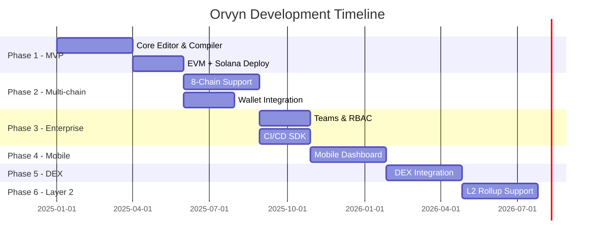

# Orvyn Platform Roadmap
> **Write once. Deploy everywhere.**  
> 6-Phase roadmap from MVP to Layer 2 dominance.

---

## Overview



---

## Phase 1 — MVP (Months 1–5)
**Goal:** Prove core value prop. Rust → EVM + Solana in one UI.

### Milestones
| # | Milestone | Owner | Duration |
|---|-----------|-------|----------|
| 1.1 | Monaco editor with Rust syntax highlighting + LSP | Frontend | 3 weeks |
| 1.2 | Rust → LLVM IR → EVM bytecode pipeline | Compiler | 6 weeks |
| 1.3 | Rust → Solana BPF pipeline | Compiler | 4 weeks |
| 1.4 | One-click deploy to Ethereum Mainnet + Goerli | Backend | 3 weeks |
| 1.5 | One-click deploy to Solana Mainnet + Devnet | Backend | 3 weeks |
| 1.6 | User auth (GitHub OAuth), project dashboard | Frontend | 2 weeks |
| 1.7 | Free tier gate (3 chains, 5 contracts/month) | Backend | 1 week |
| 1.8 | Contract ABI auto-generation + viewer | Backend | 2 weeks |
| 1.9 | Basic gas estimation display | Compiler | 1 week |
| 1.10 | Public beta launch | All | — |

### Deliverables
- Working web app at `app.orvyn.dev`
- Support for Ethereum + Solana
- User accounts with project history
- Shareable contract links

### Success Metrics
- 500 beta signups
- 1,000 contracts deployed in first 30 days
- <8s compile time for standard contracts
- NPS ≥ 40

---

## Phase 2 — Multi-Chain Expansion (Months 6–10)
**Goal:** 8-chain support. Launch paid tier. Establish market position.

### New Chains
| Chain | VM Target | Estimated Effort |
|-------|-----------|-----------------|
| Polygon | EVM (shared) | 1 week (reuse EVM pipeline) |
| BSC | EVM (shared) | 1 week |
| Near | WASM | 4 weeks |
| Polkadot | WASM (ink!) | 5 weeks |
| Cosmos | CosmWasm | 4 weeks |
| Algorand | TEAL | 6 weeks |

### Feature Milestones
| # | Feature | Priority |
|---|---------|----------|
| 2.1 | Multi-wallet integration: MetaMask, Phantom, Keplr | HIGH |
| 2.2 | Chain selector UI with live gas price feeds | HIGH |
| 2.3 | Pro tier billing ($29/mo via Stripe) | HIGH |
| 2.4 | Contract verification on Etherscan, Solscan, etc. | HIGH |
| 2.5 | Real-time compilation error overlay in editor | MEDIUM |
| 2.6 | Bytecode diff viewer between chain targets | MEDIUM |
| 2.7 | Contract template library (ERC20, SPL, etc.) | MEDIUM |
| 2.8 | Deployment history & transaction explorer | MEDIUM |
| 2.9 | Webhook notifications on deploy success/failure | LOW |

### Success Metrics
- 200 paying Pro subscribers
- MRR > $5,800
- All 8 chains passing CI integration tests

---

## Phase 3 — Enterprise Features (Months 11–14)
**Goal:** Land enterprise accounts. Enable team workflows and CI/CD.

### Milestones
| # | Feature | Description |
|---|---------|-------------|
| 3.1 | Teams & Organizations | Orgs with RBAC: Owner, Admin, Developer, Viewer |
| 3.2 | TypeScript SDK | `npm install @orvyn/sdk` for CI/CD pipelines |
| 3.3 | GitHub Actions integration | Official action: `orvyn/deploy-action@v1` |
| 3.4 | Private contract registry | Org-scoped contract versioning & storage |
| 3.5 | Audit logs | Full event log for compliance (SOC 2 prep) |
| 3.6 | SSO / SAML 2.0 | Enterprise auth via Okta, Azure AD |
| 3.7 | Environment management | Dev / Staging / Production per chain |
| 3.8 | Gas budget controls | Set max gas limits per deployment |
| 3.9 | Enterprise tier pricing | $299/mo — unlimited contracts, SLA, priority support |
| 3.10 | API rate limit tiers | Free: 100 req/hr, Pro: 1000, Enterprise: unlimited |

### TypeScript SDK Preview
```typescript
import { Orvyn } from '@orvyn/sdk';

const client = new Orvyn({ apiKey: process.env.ORVYN_API_KEY });

const result = await client.deploy({
  contractPath: './contracts/MyToken.rs',
  chains: ['ethereum', 'polygon', 'solana'],
  environment: 'production',
  gasStrategy: 'optimized',
});

console.log(result.addresses); // { ethereum: '0x...', polygon: '0x...', solana: '...' }
```

### Success Metrics
- 10 enterprise accounts signed
- ARR > $250,000
- SDK downloaded 5,000+ times/month

---

## Phase 4 — Mobile Dashboard (Months 15–18)
**Goal:** Monitor and manage deployments from mobile. Expand reach.

### Milestones
| # | Feature |
|---|---------|
| 4.1 | React Native app (iOS + Android) |
| 4.2 | Deployment status push notifications |
| 4.3 | Gas price alerts (set thresholds per chain) |
| 4.4 | Contract call interface (read + write) from mobile |
| 4.5 | Biometric auth + hardware wallet support (Ledger BLE) |
| 4.6 | Tauri desktop app (Windows, macOS, Linux) |
| 4.7 | Offline contract editor with sync on reconnect |

### Desktop App (Tauri)
- Native performance, Rust backend
- Local LLVM compilation (no cloud needed for compile-only)
- Sync projects to cloud when online

---

## Phase 5 — DEX Integration (Months 19–22)
**Goal:** Become the deployment hub for DeFi protocols.

### Milestones
| # | Feature |
|---|---------|
| 5.1 | One-click liquidity pool deployment (Uniswap V3, Raydium) |
| 5.2 | AMM contract templates with customizable fee tiers |
| 5.3 | Cross-chain token bridge contract generation |
| 5.4 | Price oracle integration (Chainlink, Pyth) in templates |
| 5.5 | DEX protocol simulator (test swaps before deploy) |
| 5.6 | MEV protection contract patterns |
| 5.7 | Automated slippage & liquidity analysis post-deploy |
| 5.8 | Partnership: Uniswap, Jupiter, Osmosis as featured targets |

---

## Phase 6 — Layer 2 Support (Months 23–27)
**Goal:** Full L2 coverage. Position as the cross-chain/L2 deployment standard.

### Target L2s
| L2 | Type | VM |
|----|------|----|
| Arbitrum | Optimistic rollup | EVM (ArbOS) |
| Optimism | Optimistic rollup | EVM (OP Stack) |
| Base | Optimistic rollup | EVM (OP Stack) |
| zkSync Era | ZK rollup | zkEVM |
| StarkNet | ZK rollup | Cairo VM |
| Scroll | ZK rollup | zkEVM |
| Linea | ZK rollup | zkEVM |
| Polygon zkEVM | ZK rollup | zkEVM |

### Milestones
| # | Feature |
|---|---------|
| 6.1 | zkEVM compatibility layer (Rust → zkEVM bytecode) |
| 6.2 | Cairo contract generation from Rust abstractions |
| 6.3 | L1→L2 message passing helper contracts |
| 6.4 | Gas comparison across all L2s before deploy |
| 6.5 | Rollup-specific optimizations (calldata compression) |
| 6.6 | Multi-chain atomic deployment (deploy to 10 chains in 1 tx bundle) |

---

## Pricing Tiers (All Phases)

| Tier | Price | Chains | Contracts/mo | Team Members | Support |
|------|-------|--------|--------------|--------------|---------|
| **Free** | $0 | 3 | 5 | 1 | Community |
| **Pro** | $29/mo | Unlimited | Unlimited | 3 | Email |
| **Enterprise** | $299/mo | Unlimited + L2 | Unlimited | Unlimited | SLA + Slack |

---

## Risk Register

| Risk | Probability | Impact | Mitigation |
|------|------------|--------|------------|
| Chain API instability | High | High | Multi-RPC fallback per chain |
| Rust → Cairo compilation complexity | High | Medium | Abstract via WASM intermediate |
| Wallet SDK breaking changes | Medium | High | Version-pinned adapters per wallet |
| Compiler security vulnerabilities | Low | Critical | Sandboxed compilation, regular audits |
| Competitor copy (Hardhat adds multi-chain) | Medium | High | Network effects, template library moat |